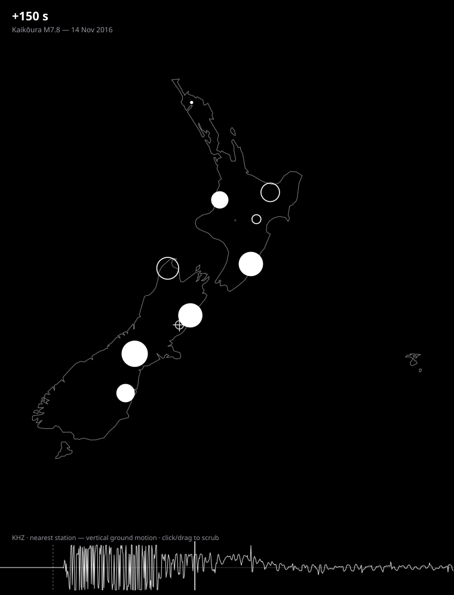

# GeoNet ShakeMap

A static, self-contained web visualisation of **real GeoNet seismic waveforms
propagating across Aotearoa New Zealand**. It plots real sensor locations on a
black-and-white map (mainland **and the Chatham Islands**) and animates the
ground motion recorded at each site, so you can watch the wavefront of an
earthquake spread outward in slow motion.

Rendering convention:

| Ground motion at a sensor | Circle |
| --- | --- |
| moving **up** (positive amplitude) | **solid** disc, radius ∝ shaking |
| moving **down** (negative amplitude) | **hollow** ring, radius ∝ shaking |
| epicentre | crosshair marker |

Pick from several real historical NZ earthquakes in the header dropdown
(Kaikōura 2016, Christchurch 2011, Darfield 2010, Dusky Sound 2009). The strip
along the bottom is the **real seismogram of the station nearest the epicentre**
— a single trace centred on zero, positive up / negative down — with the
playhead and origin marked; click or drag it to scrub.



## Quick start

```bash
npm install
npm run dev          # http://localhost:5173
```

Build the static site and serve it:

```bash
npm run build        # → dist/  (type-checked, everything bundled, no CDNs)
npm run preview      # serve dist/ locally
```

The build is fully self-contained: the coastline is inlined into the JS bundle
and the dataset is a plain `dist/data/event.json`. Serve `dist/` with any static
file server.

## Controls

- **Earthquake picker** (header) — switch between the events in the catalogue.
- **Play / pause** (or the spacebar).
- **Timeline** (bottom) — the real seismogram of the station nearest the
  epicentre, a single line centred on zero (up = positive, down = negative);
  **click or drag to scrub**, or focus it and use ←/→ (Shift for bigger steps),
  Home/End.
- **Speed** presets from real-time (`1×`) down to **`0.05×`** slow motion.
- **Loop** toggle (on by default).
- **Normalise**: `per station` (default — every site shows a clear pulse as its
  wave arrives, best for seeing propagation) or `uniform` (one global scale, so
  near-field intensity dominates — true relative amplitude).
- **P/S waves** — schematic wavefronts expanding from the epicentre: a dashed
  outer P front (~6.0 km/s) and a solid inner S front (~3.5 km/s), stopping once
  past the farthest detector. Representative crustal velocities, not a per-event
  travel-time model.

## The data

The app loads `public/data/catalog.json` (the list of events) and then one
`public/data/events/<id>.json` per event — every dataset shares the same JSON
shape ([`src/data/types.ts`](src/data/types.ts) → `ShakeDataset`). **Adding an
earthquake** = drop in another `events/<id>.json` and add a `catalog.json` entry;
both builders below do that for you.

### 1. The checked-in samples (real, ship with the repo)

Four historical events — **Kaikōura 2016, Christchurch 2011, Darfield 2010,
Dusky Sound 2009** — built from **real recorded waveforms** for the NZ backbone
broadband stations (mirrored by [EarthScope](https://www.earthscope.org/),
including `KHZ` right by the Kaikōura epicentre and `CTZ` on the Chatham Islands
as a located site). They're small, work offline, and are what the app loads out
of the box.

Each event is cropped to its **shaking window** ([`data/window`](src/data/window.ts)):
the station nearest the epicentre defines it, starting 5 s before major shaking
begins there and ending once its significant duration (Arias 5–95% energy) is
over. Rebuild them from the raw miniSEED with:

```bash
npm run build-sample     # data-raw/<id>_hhz.mseed → public/data/events/*.json + catalog.json
```

### 2. The full dense dataset (GeoNet AWS Open Data)

For the *dense* network (hundreds of strong-motion + broadband sensors), run the
pipeline against GeoNet's public [AWS Open Data bucket](https://registry.opendata.aws/geonet/):

```bash
npm run fetch-data       # → public/data/events/<datasetId>.json, upserts catalog.json
```

[`scripts/fetch-data.ts`](scripts/fetch-data.ts):

1. Reads the GeoNet station catalogue (`data-raw/delta_stations.csv`), keeps
   stations active on the event date and inside the NZ region, and **thins them
   to one representative per grid cell** (the data-layer twin of the map's
   on-screen decimation) so it doesn't download the entire archive.
2. For each station, GETs the day's miniSEED straight from the public S3 bucket
   (no credentials, plain HTTPS), decodes it with our own Steim reader, windows
   it to the event, and resamples onto the common grid.
3. Writes an `events/<id>.json` in the same shape the app already understands and
   adds/updates its `catalog.json` entry.

Configure the event (id, metadata, time window), channels (strong-motion `HNZ`
is preferred over broadband `HHZ`), region, and thinning density in the `CONFIG`
block at the top of the script.

> **Note — why there are two datasets.** GeoNet's AWS bucket, FDSN service, and
> data API are all hosted in AWS `ap-southeast-2` (Sydney). This repo was built
> in a sandbox that can't reach that region, so the pipeline can't run here — but
> it runs fine from a normal machine (e.g. anywhere in NZ). The EarthScope
> sample is the real-data stand-in that works everywhere.

### Regenerating the raw inputs

The `data-raw/` inputs are git-ignored (reproducible). To refetch:

```bash
mkdir -p data-raw
# GeoNet station catalogue (mainland + Chathams)
curl -sSL https://raw.githubusercontent.com/GeoNet/delta/main/network/stations.csv \
  -o data-raw/delta_stations.csv
# Natural Earth coastline (mainland + Chathams), then simplify + bundle it
curl -sSL https://raw.githubusercontent.com/nvkelso/natural-earth-vector/master/geojson/ne_50m_land.geojson \
  -o data-raw/ne_50m_land.geojson
npm run build-coastline   # → src/geo/nz-coastline.json
# Real sample waveforms per event (EarthScope mirror), e.g. Kaikōura:
S="BFZ,BKZ,CTZ,HIZ,KHZ,ODZ,OUZ,QRZ,RPZ,URZ,WPVZ"
curl -sSL "https://service.earthscope.org/fdsnws/dataselect/1/query?net=NZ&sta=$S&cha=HHZ&start=2016-11-13T11:02:00&end=2016-11-13T11:10:00" \
  -o data-raw/kaikoura_hhz.mseed
# (and christchurch-2011, darfield-2010, dusky-sound-2009 — see the windows in scripts/build-sample.ts)
npm run build-sample      # → public/data/events/*.json + catalog.json
```

## Testing

```bash
npm test                 # vitest, 101 tests
npm run coverage
```

Per the brief, tests **concentrate on the data-transformation algorithms** — the
parts that can actually be wrong — rather than the DOM/canvas glue:

| Module | What's tested |
| --- | --- |
| [`geo/projection`](src/geo/projection.ts) | lon-wrapping (Chatham east of the mainland), bounds, fit-to-canvas, north-up, aspect |
| [`geo/simplify`](src/geo/simplify.ts) | Douglas–Peucker perpendicular distance & polyline reduction |
| [`data/miniseed`](src/data/miniseed.ts) | miniSEED framing, BTIME, sample-rate, **Steim-1/2 decoding** (synthetic INT32 record + a real Kaikōura Steim-2 record with its built-in integrity check) |
| [`data/decimate`](src/data/decimate.ts) | grid decimation → representative-per-cell, priority & determinism |
| [`data/amplitude`](src/data/amplitude.ts) | trace interpolation, robust normalisation scale, amplitude → radius/fill |
| [`data/resample`](src/data/resample.ts) | anti-aliased box resample + DC-baseline removal |
| [`data/window`](src/data/window.ts) | significant-duration (Arias 5–95%) shaking-window detection |
| [`geo/distance`](src/geo/distance.ts) | haversine distance, nearest-station selection, destination-point + wavefront rings (antimeridian-safe) |
| [`data/waveform`](src/data/waveform.ts) | signed peak-preserving decimation for the seismogram timeline |
| [`playback/clock`](src/playback/clock.ts) | speed scaling, looping/wrap, clamp-and-stop, seek |

Lint/format with Google's style ([gts](https://github.com/google/gts)):

```bash
npm run lint
npm run fix
```

## Project layout

```
src/
  geo/        projection (incl. Chatham), distance/nearest, coastline simplify, nz-coastline.json
  data/       types, miniSEED/Steim decoder, decimation, amplitude, resample, waveform
  playback/   playback clock (slow-mo + loop)
  render/     black-and-white map renderer + bottom trace-strip renderer
  main.ts     glue: catalogue → load event → project → decimate → animate → controls
scripts/
  build-coastline.ts   Natural Earth land → bundled NZ coastline
  build-sample.ts      raw miniSEED → checked-in sample event.json
  fetch-data.ts        GeoNet AWS Open Data → full dense event.json
  render-snapshot.ts   static SVG preview at a chosen time
```

## Tech

Vite + TypeScript, gts (Google TypeScript style), Vitest. **Zero runtime
dependencies** — the projection, miniSEED/Steim decoder, decimation and renderer
are all first-party and bundled; nothing is fetched from a CDN.

## Data attribution

Waveforms and station metadata: **GeoNet** (GNS Science / Toka Tū Ake EQC),
CC BY 3.0 NZ, via the GeoNet AWS Open Data Registry and the EarthScope FDSN
mirror. Coastline: **Natural Earth** (public domain).
